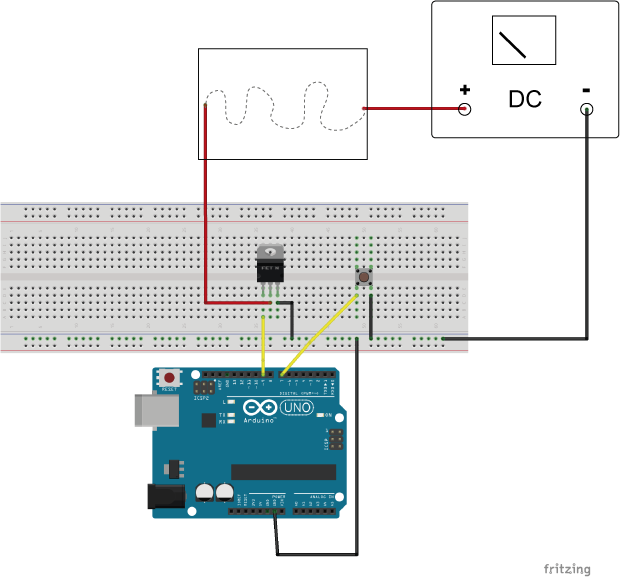
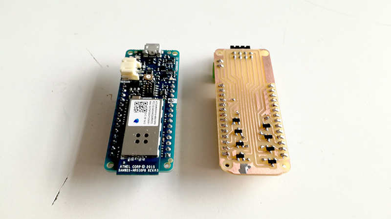

# Heat-controlling-circuit-for-thermochromic-pigments

## Overview
Thermochromic inks are pigments that change color to colorless at certain temperature. There are many different types of thermochromic pigments including textile inks for textile screen printing.

You may use any heat source or your body heat to change the color of thermochromic prints. But also, we can use electricity to heat up certain parts of the fabric to achieve dynamic pattern on fabric.
When large current goes through low resistance conductive material, it emits heat. We can use this method to heat up conductive threads to change colors of the prints.


## Calculations
All conductive threads have different properties, the resistance per meter is different in all of them.
The ideal conductive threads to build a heating source are made of steel or copper like Bekinox stainless steel thread from Bekaert or Copper thread from KarlGrimm.

The best scenario would be to have a 6-50 Ohm conductive thread with a current of 300-1000 mA flowing through it. The time the thermochromic ink takes to change its color is directly proportional to the amount of current. For 300mA it will need more time than for 1000mA.

To calculate the voltage we just need to use ohm's law formula:

Voltage equals Current times Resistance or V = I x R

We know our conductive thread resistance(measured with the multimeter), for example 32 ohm, the current has to be a value from 300mA to 1000mA.

For 300mA:

V = 0,3 * 32 => V = 9,6V

For 1000mA:

V = 1 * 32 => V = 32V

## One conductive thread test circuit

##### Materials
- Arduino UNO board
- Transistor, TIP122 or IRLZ24N or IRLB8743
- Conductive thread
- Jumper wires
- Protoboard
- Variable DC power supply

##### Wiring



##### Code - [view](code/_1_thread_test/)

```c++
int btnPin = 7;
int mosfetPin = 9;

void setup() {
  // put your setup code here, to run once:
  pinMode(btnPin,INPUT_PULLUP);
  pinMode(mosfetPin,OUTPUT);
  Serial.begin(9600);
}

void loop() {
  // put your main code here, to run repeatedly:
  int btnState = digitalRead(btnPin); //reads a stores button state
  if(btnState==LOW){
    //button is pressed, so START heating up the conductive thread
    digitalWrite(mosfetPin,HIGH);
  }else{
    //button is released, so STOP heating up the conductive thread
    digitalWrite(mosfetPin,LOW);
  }
}
```


## Multiple conductive threads circuit



##### Materials
- Arduino MKR1000
- 8x Transistor BC817
- 8x Conductive thread

##### PCB


[schematic & pcb files](pcb/)


##### Code - [view](code/_8_threads_test/)

```c++
#define numStrings 8

int actualString = 0;
int actualTime;
int intervalON = 8000;
int intervalOFF = 10000;
boolean state = 0;

const int pins[numStrings] = {
  9,8,7,6,5,4,3,2
};

const int timeON[numStrings] = {
  7000,9000,10000,10000,5000,6500,8000,10000
};

void setup() {
  // put your setup code here, to run once: 
  Serial.begin(9600);

  for(int i=0;i<numStrings;i++){
    pinMode(pins[i],OUTPUT);
  }

  actualTime = millis();
  
}

void loop() {
  // put your main code here, to run repeatedly:
  if(state==0 && millis()<(actualTime+timeON[actualString]))
  {
    int left = (actualTime+timeON[actualString])-millis();
    Serial.print("ON ");
    Serial.print(" : ");
    Serial.print(actualString);
    Serial.print(" : ");
    Serial.println(left);
    analogWrite(pins[actualString],255);
  }else if (state==0 && millis()>(actualTime+intervalON)){
    actualTime = millis();
    state=1;
  }

  if(state==1 && millis()<(actualTime+intervalOFF))
  {
    int left = (actualTime+intervalOFF)-millis();
    Serial.print("OFF ");
    Serial.print(" : ");
    Serial.print(actualString);
    Serial.print(" : ");
    Serial.println(left);
    analogWrite(pins[actualString],0);
  }else if (state==1 && millis()>(actualTime+intervalOFF)){
    actualTime = millis();
    state=0;
    actualString++;
    if(actualString>=8){
      actualString=0;
      Serial.println("stop");
      delay(10000);
    }
  }
}
```


```## Powering


